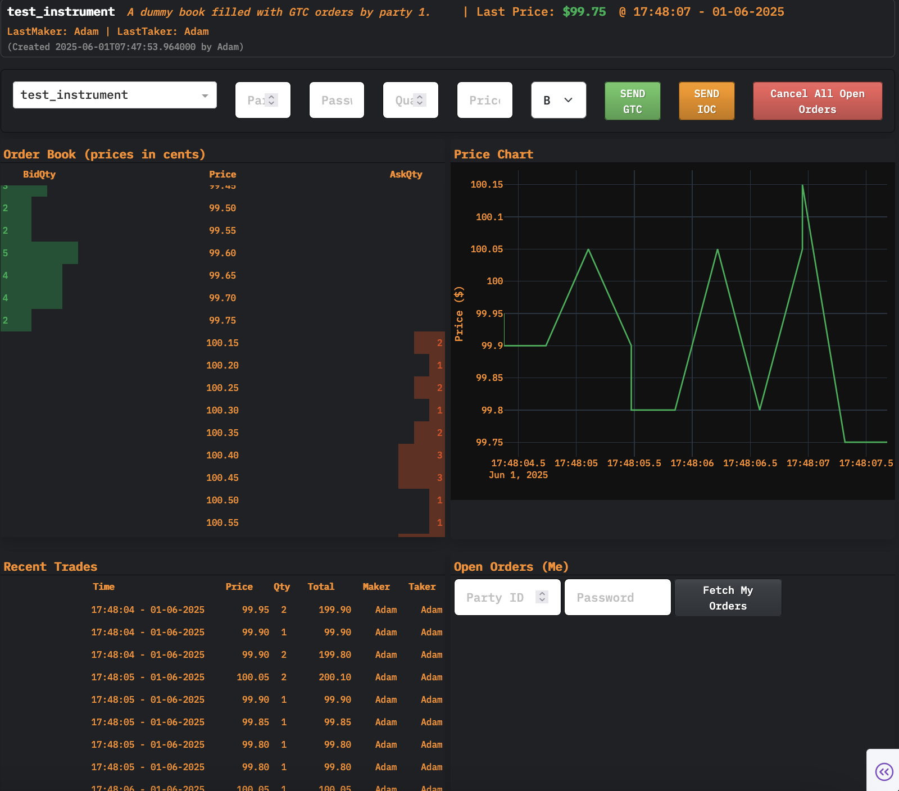
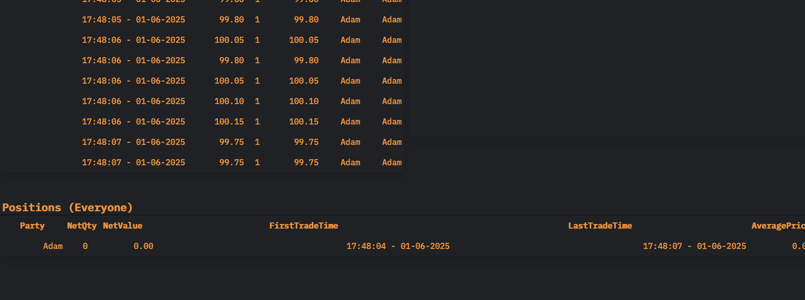

# 💸 Redleaf Exchange

<div align="center">
  
  
  
  
</div>



<br>

A high-performance, real-time order matching engine with REST API, WebSocket dashboard, and client SDK.

## Table of Contents

1. [Introduction](#introduction)
2. [Features](#features)
3. [Architecture & Structure](#architecture--structure)
4. [Getting Started](#getting-started)

   * [Prerequisites](#prerequisites)
   * [Installation](#installation)
   * [Configuration](#configuration)
5. [Running the API Server](#running-the-api-server)
6. [Client SDK Usage](#client-sdk-usage)
7. [Web Dashboard](#web-dashboard)
8. [Key Components](#key-components)

   * [Order Book](#order-book)
   * [Exchange Core](#exchange-core)
   * [Persistence & Writers](#persistence--writers)
   * [Authentication](#authentication)
   * [Logging](#logging)
   * [CLI Utilities](#cli-utilities)
9. [Testing](#testing)
10. [Contributing](#contributing)
11. [License](#license)

---

## Introduction

Redleaf Exchange is a fully-featured matching engine built in Python using FastAPI. It supports:

* **Limit, Market, IOC Orders** with price-time priority.
* **Persistent storage** in MongoDB (orders, trades, live orders).
* **Multicast broadcasting** of real-time events for live dashboards.
* **Text backups** for CSV logging.
* **Client SDK** for easy integration.
* **Dash-based Web UI** for live order book, trades, charts, and positions.
* **Comprehensive testing** (unit, integration, end-to-end).

Whether you need a local testbed or a production-grade engine, Redleaf Exchange offers flexibility and performance.

---

## Features

* **REST API** with authenticated endpoints for creating instruments, placing/canceling orders, and querying state.
* **Order Types**: GTC (Good-Til-Cancelled), IOC (Immediate-Or-Cancel), Market.
* **Price-Time Priority** matching engine with efficient heaps and per-price FIFO queues.
* **Persistence**: non-blocking MongoDB writes, text CSV backups, and multicast events.
* **Client Library**: `exchange_client.py` for Python applications, handling JSON, validation, and errors.
* **Web Dashboard**: Dash app for real-time visualization.
* **Scripts**: Utilities to populate dummy data, bootstrap DB, and manage parties.
* **Logging**: Rotating logs every 15 minutes, console and file.
* **Extensive Tests**: Unit and integration tests ensure correctness under load.

---

## Architecture & Structure

```
RedleafExchange/
├── apps/exchange/               # Core exchange implementation
│   ├── api.py                   # FastAPI app: routes, startup/shutdown
│   ├── exchange.py              # Exchange class: request handling, rebuild
│   ├── order_book.py            # OrderBook: matching logic, price levels
│   ├── models.py                # Data classes: Order, Trade, Side, OrderType
│   ├── composite_writer.py      # Fan-out wrapper for multiple writers
│   ├── mongo_queued_db_writer.py# Async, non-blocking MongoDB writer
│   ├── multicast_writer.py      # UDP multicast for real-time events
│   ├── text_backup_writer.py    # CSV backup writer
│   ├── mongo_admin.py           # Admin utilities (create users, DBs)
│   ├── mongo_party_auth.py      # Party authentication via MongoDB (`/parties`)
│   ├── settings.py              # Configuration via environment variables
│   └── logging.py               # Logging setup (rotating file, console)
│
├── apps/trader/                 # Client SDK and examples
│   └── bot_trader/public_endpoints.py  # ExchangeClient, config, errors
│
├── exchange_dash_app.py         # Dash dashboard implementation
├── exchange_client.py           # Standalone client library for scripts/apps
│
├── scripts/                     # CLI scripts
│   ├── populate_dummy_test_instrument.py  # Populate a test instrument with orders
│   ├── bootstrap_db.py                  # Create MongoDB collections & indexes
│   ├── import_parties.py                # Load `parties.csv` into MongoDB
│   └── <other utility scripts>.py
│
├── tests/                        # Tests (unit, integration, end-to-end)
│   ├── test_app.py               # API integration tests with DummyWriter
│   ├── test_order_book_extended.py # Deep OrderBook unit tests
│   ├── test_end_to_end.py        # End-to-end tests against a running API + real MongoDB
│   ├── conftest.py               # Shared fixtures (e.g. PWD)
│   └── <more test files>.py
│
├── assets/                       # Static assets for README and dashboard
│   ├── banner.png
│   ├── exchange_client_page_1.png
│   ├── exchange_client_page_2.png
│   └── favicon.ico
│
├── .env                          # Environment variables (API_URL, PARTY_ID, PASSWORD, MONGO settings, etc.)
├── requirements.txt              # Python dependencies
├── Dockerfile                    # (Optional) Containerization
└── README.md                     # This file
```

---

## Getting Started

### Prerequisites

* Python 3.9+
* MongoDB 4.x running locally or remotely
* (Optional) Docker

Install dependencies:

```bash
pip install -r requirements.txt
```

Create a `.env` file in the project root:

```ini
API_URL=http://localhost:8000
PARTY_ID=1
PASSWORD=pw
MONGO_HOST=localhost
MONGO_PORT=27017
MONGO_DB=exchange
MONGO_USER=
MONGO_PASS=
ADMIN_ID=1
ADMIN_PASSWORD=admin
MCAST_GROUP=224.1.1.1
MCAST_PORT=4444
```

### Installation

1. Clone this repository:

```bash
 git clone [https://github.com/your-org/RedleafExchange.git](https://github.com/your-org/RedleafExchange.git)
cd RedleafExchange
```

2. Create a virtual environment (optional):
```bash
python3 -m venv venv
source venv/bin/activate
```

3. Install Python dependencies:
```bash
pip install -r requirements.txt
```


### Configuration

All settings (Mongo, multicast, admin credentials) are controlled via `apps/exchange/settings.py`, which reads environment variables.
Adjust as needed in your `.env` or environment.

---

## Running the API Server

Start MongoDB if not running (e.g., `brew services start mongodb-community`).

Launch the FastAPI server:
```bash
uvicorn apps.exchange.api:app --host 0.0.0.0 --port 8000 --reload
````

On startup, the following occurs:

* Logging is configured (`utils/logging.py`).
* `Exchange.rebuild_from_database()` loads existing orders/trades from Mongo.
* `QueuedDbWriter.startup()` starts the background writer loop.

### API Endpoints

* **POST `/new_book`**
  Create a new instrument (admin only).
  **Request body** (JSON):

  ```json
  {
    "instrument_id": 100,
    "instrument_name": "BTC-USD",
    "instrument_description": "Bitcoin / US Dollar",
    "party_id": 1,
    "password": "admin"
  }
  ```

  **Response**:

  * `{ "status": "CREATED", "instrument_id": 100 }` on success.
  * `{ "status": "ERROR", "details": "instrument already exists" }` if duplicate.

* **POST `/orders`**
  Place a new order (GTC, IOC, MARKET).
  **Request body**:

  ```json
  {
    "instrument_id": 100,
    "side": "BUY",
    "order_type": "GTC",
    "price_cents": 5000,    // required for GTC/IOC
    "quantity": 2,
    "party_id": 2,
    "password": "pw"
  }
  ```

  **Response**:

  ```json
  {
    "status": "ACCEPTED",
    "order_id": 42,
    "remaining_qty": 2,
    "cancelled": false,
    "trades": [ /* any immediate fills */ ]
  }
  ```

  * For MARKET orders, omit `price_cents` (it defaults to 0).
  * For IOC, unfilled portion is automatically canceled.
  * On validation error or unknown instrument: HTTP 422 with error details.

* **POST `/cancel`**
  Cancel an existing open order.
  **Request body**:

  ```json
  {
    "instrument_id": 100,
    "order_id": 42,
    "party_id": 2,
    "password": "pw"
  }
  ```

  **Response**:

  ```json
  { "status": "CANCELLED", "order_id": 42 }
  ```

  * If order was already filled/canceled or not found: `{ "status": "ERROR", "details": "order not open" }`.

* **GET `/instruments`**
  List all instruments (no auth required).
  **Response**: Array of instrument metadata from Mongo (ID, name, description, created time, created by).

* **GET `/orders/{instrument_id}`**
  List all historical orders for an instrument (sorted by `order_id`).
  **Response**: Array of order documents from `orders_<instr>`.

* **GET `/live_orders/{instrument_id}`**
  List all currently open (unfilled, uncanceled) orders.
  **Response**: Array from `live_orders_<instr>`.

* **GET `/trades/{instrument_id}`**
  List all executed trades for an instrument (sorted by timestamp).

* **GET `/parties`**
  List all parties (ID + name) for display.

---

## Client SDK Usage

Use `exchange_client.py` or the `ExchangeClient` in `apps/trader/bot_trader/public_endpoints.py` to interact programmatically.

Example:

```python
from exchange_client import ExchangeClient, ExchangeClientConfig, ValidationError, ExchangeClientError

config = ExchangeClientConfig(api_url="http://localhost:8000", default_party_id=2, default_password="pw")
client = ExchangeClient(config)

# Create a book (admin)
try:
    resp = client.create_order_book(instrument_id=100, instrument_name="ABC", instrument_description="Test")
    print("Created", resp)
except Exception as e:
    print("Error creating book:", e)

# Place a GTC SELL
try:
    sell = client.place_order(instrument_id=100, side="SELL", order_type="GTC", price_cents=10000, quantity=5)
    print("Sell order placed", sell)
except ValidationError as ve:
    print("Validation error:", ve.details)
except ExchangeClientError as ce:
    print("Client error:", ce)

# Cancel an order
cancel = client.cancel_order(instrument_id=100, order_id=42)
print("Cancel response", cancel)
```

The SDK handles JSON serialization, HTTP errors, and validation.

---

## Web Dashboard

A real-time dashboard built with Dash (Plotly) and multicast events.

Run:

```bash
python exchange_dash_app.py
```

Features:

* **Banner**: Instrument name, description, last trade price/time, maker/taker.
* **Order Entry**: Place GTC/IOC orders, cancel all open orders.
* **Order Book**: Live bid/ask levels with colored quantity bars.
* **Price Chart**: Real-time price line chart + 20-period moving average.
* **Recent Trades**: Scrollable table of latest trades.
* **Open Orders (Me)**: View and cancel your party’s open orders.
* **Positions (Everyone)**: Net position summary (qty, value, avg price, trade times).

The dashboard fetches initial state via REST (`/live_orders`, `/trades`) and then listens to UDP multicast (GROUP\:PORT) for live updates.

---

## Key Components

### Order Book (`apps/exchange/order_book.py`)

* **`PriceLevel`**: Maintains a FIFO queue of orders at a given price, prunes filled/canceled.
* **`PriceHeap`**: A min-heap for asks (and max-heap via negation for bids) with lazy deletion.
* **`OrderBook`**:

  * `submit(order: Order)` handles MARKET, GTC, IOC:

    * **MARKET**: Repeatedly match best price until no quantity or no counter orders.
    * **GTC**: Match at or better prices, then rest any residue.
    * **IOC**: Match at or better prices, then cancel any residue.
  * `rest_order`: Inserts into price-level map and heap, and into `oid_map`.
  * `cancel(order_id)`: Idempotent cancel, cleans up heap/level and removes from `oid_map`.
  * Matching uses `_match_limit`, `_execute_market`, and `_match_orders` to generate `Trade` objects and fill both sides.
  * `best_bid()` / `best_ask()` return top-of-book prices or `None`.

### Exchange Core (`apps/exchange/exchange.py`)

* **Pydantic DTOs**:

  * `NewOrderReq`: Validates `instrument_id`, `side`, `order_type`, `price_cents`, `quantity`, `party_id`, `password`.
  * `CancelReq`: Validates `instrument_id`, `order_id`, `party_id`, `password`.

* **`Exchange` Class**:

  * Manages multiple `OrderBook` instances in memory (`self._books`).
  * `create_order_book(instrument_id)`: Instantiates an `OrderBook`, calls writers to create DB collections.
  * `handle_new_order(payload)`: Validates via Pydantic, retrieves the book, builds a new `Order` with a unique `order_id`, submits to `OrderBook`, records orders/trades, updates live orders via writers, returns JSON.
  * `handle_cancel(payload)`: Validates, retrieves book, calls `book.cancel(order_id)`, updates writers, returns JSON.
  * Cold-start: `rebuild_from_database()` streams all orders from writers’ `iter_orders()`, replays live ones into `OrderBook`, and sets `self._next_oid`.

### Persistence & Writers

#### CompositeWriter (`apps/exchange/composite_writer.py`)

* Wraps multiple writer backends (ordered as primary, secondary, …). Any call (e.g., `record_order`, `record_trade`, `record_cancel`, `create_instrument`, `iter_orders`, `list_instruments`) is fanned out: the first writer’s return value is returned, and others are called for side effects.

#### MongoQueuedDbWriter (`apps/exchange/mongo_queued_db_writer.py`)

* **Sync client** (PyMongo) used during `rebuild_from_database()`: `list_instruments()`, `iter_orders()`, `create_instrument()` use blocking calls.
* **Async client** (Motor) for hot-path writes:

  * Maintains an `asyncio.Queue[(msg_type, payload)]`.
  * Methods (`record_order`, `record_trade`, `record_cancel`, `upsert_live_order`, `remove_live_order`, `update_order_quantity`) simply enqueue messages, never blocking.
  * Background consumer loop drains the queue and executes DB operations (inserting into `orders_<instr>`, `trades_<instr>`, deleting/upserting into `live_orders_<instr>`).
  * `startup()` spawns the loop; `shutdown()` flushes remaining writes and cancels.

#### TextBackupWriter (`apps/exchange/text_backup_writer.py`)

* For each instrument:

  * Creates CSV files: `orders_<instr>.csv`, `trades_<instr>.csv`, `cancels_<instr>.csv`, `live_events_<instr>.csv`.
  * On `record_order`, `record_trade`, `record_cancel`, `upsert_live_order`, schedules an `asyncio.to_thread` that writes a row to the appropriate CSV.
  * Does not support replay (`iter_orders()` returns empty).

#### MulticastWriter (`apps/exchange/multicast_writer.py`)

* Sends JSON-encoded events (`ORDER`, `TRADE`, `CANCEL`) via UDP to a multicast group/port for real-time consumption.
* Methods (`record_order`, `record_trade`, `record_cancel`) serialize the payload and send over UDP.
* Used by `exchange/api.py` to push live updates to dashboards.

### Authentication (`apps/exchange/mongo_party_auth.py`)

* **`MongoPartyAuth`** loads all party records (`party_id`, bcrypt-hashed `password`) from Mongo into a cache.

  * `verify(party_id, password)`: Checks cache or fetches from Mongo.
  * `get(party_id)`: Returns party document (minus `_id`).

* **`Auth`** dependency for FastAPI:

  * `require_admin=False`: Verifies `party_id`/`password` via `MongoPartyAuth.verify`, fetches party data, and attaches it to `request.state.party`.
  * `require_admin=True`: Additionally checks `party_doc['is_admin']`.
  * Used in `api.py`: Admin routes (`/new_book`) require admin, others use common auth.

### Logging (`apps/exchange/logging.py`)

* **`setup(level, fname)`** configures the root logger once:

  * Console handler with a formatted output (`timestamp | level | name | message`).
  * `QuarterHourRotator` file handler (rotates every 15 minutes, unlimited backups).

* **`QuarterHourRotator`** extends `TimedRotatingFileHandler` to roll files every 15 minutes without altering the base filename format.

### CLI Utilities (`scripts/`)

* **`populate_dummy_test_instrument.py`**

  * Creates a test instrument (ID 9999) and populates with 20 bid & ask GTC orders, then sends random market orders to generate trades.
  * Uses `ExchangeClient` to interact with the API.

* **`bootstrap_db.py`**

  * Creates MongoDB collections & indexes for a list of instrument IDs (e.g., `[1,2,3,4,5]`).
  * Uses `MongoAdmin` to issue `createIndexes` for each collection: `orders_<instr>`, `trades_<instr>`, `live_orders_<instr>`.

* **`import_parties.py`**

  * Reads `scripts/parties.csv` with fields: `party_id,party_name,password,is_admin`.
  * Hashes passwords with `bcrypt` and inserts into `parties` collection.
  * Skips invalid rows.

* **`<other>`**: Scripts for additional tasks (e.g., cleaning up, backups).

---

## Testing

### Unit Tests

* **OrderBook Tests** (`tests/test_order_book_extended.py`): Extensive fuzz tests, priority, matching logic, cancel behavior, heap pruning.
* **API Integration** (`tests/test_app.py`, `tests/conftest.py`): Spins up a FastAPI app with `DummyWriter` to simulate persistence, tests endpoints.
* **Client SDK Examples** (`apps/trader/bot_trader/examples/example_endpoints.py`): Demonstrates typical flows.

Run:

```bash
pytest -v
```

### End-to-End Tests (`tests/test_end_to_end.py`)

* Requires a running API server and real MongoDB.
* **TestFlow**:

  1. Admin client creates books 100, 200, 300, 400.
  2. Non-admin places/cancels orders, verifies matching and residuals.
  3. High-volume fuzz tests.
  4. Final database state checks for invariants (total filled quantities, live orders, trade counts).

Environment: Ensure `EXCHANGE_API_URL` and Mongo credentials match.

---

## Contributing

We welcome contributions! Please:

1. Fork the repo and create a feature branch.
2. Write tests for new functionality.
3. Submit a PR with clear description.

For major changes, open an issue first to discuss.

---

## License

This project is licensed under the [MIT License](LICENSE).

---

**Enjoy trading!**

*— The Redleaf Exchange Team*
