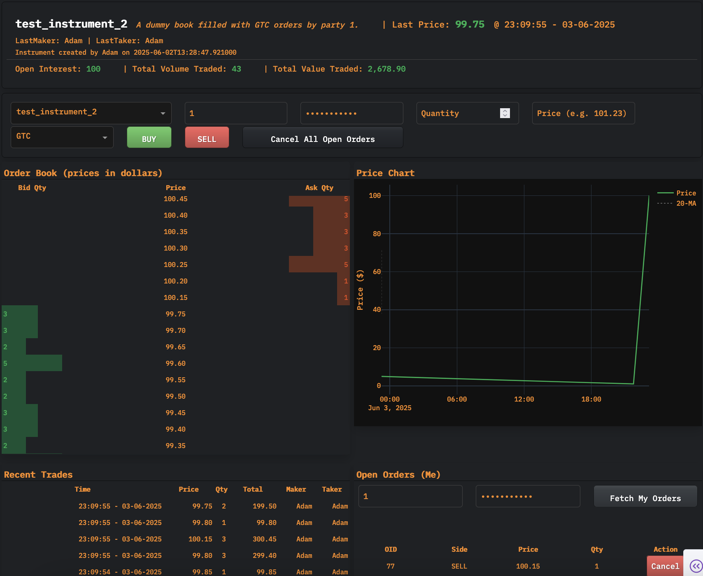

# 💸🍁 Redleaf Exchange 🍁💸

<div align="center">
  
  
  
  
</div>



A high-performance, real-time order-matching engine and dashboard built on FastAPI, MongoDB, and Dash. This system provides:

* **A RESTful API** for managing instruments, placing/canceling orders, and querying order/trade histories.
* **An in-memory OrderBook** that matches Market, GTC (Good-Till-Canceled), and IOC (Immediate-Or-Cancel) orders with price-time priority.
* **MongoDB persistence** for all orders, live orders, and trades (via a queued background writer).
* **A Python `ExchangeClient`** wrapper to interact with the API in a clean, exception-safe way.
* **A Dash-based dashboard** (“Redleaf Exchange Dashboard”) that visualizes order book depth, recent trades, open orders, and party positions in real time.

---

## Table of Contents

1. [Architecture Overview](#architecture-overview)
2. [API Endpoints](#api-endpoints)

   * [Authentication](#authentication)
   * [Instrument Management](#instrument-management)
   * [Orders](#orders)
   * [Cancels](#cancels)
   * [Queries (Orders / Live Orders / Trades)](#queries-orders--live-orders--trades)
   * [Parties](#parties)
3. [ExchangeClient (Python Library)](#exchangeclient-python-library)

   * [Configuration](#configuration)
   * [Common Operations](#common-operations)
   * [Error Handling](#error-handling)
4. [MongoDB Schema & Persistence](#mongodb-schema--persistence)

   * [`instruments` Collection](#instruments-collection)
   * `orders_<instrument_id>` Collections
   * `live_orders_<instrument_id>` Collections
   * `trades_<instrument_id>` Collections
   * `parties` Collection (Authentication)
   * [`counters` Collection](#counters-collection)
5. [Running the Exchange API](#running-the-exchange-api)

   * [Environment Variables](#environment-variables)
   * [Starting FastAPI](#starting-fastapi)
   * [Initializing Mongo Collections & Indexes](#initializing-mongo-collections--indexes)
6. [Dash Dashboard](#dash-dashboard)

   * [Overview](#overview)
   * [Key Views & Interaction](#key-views--interaction)
7. [Testing](#testing)

   * [Unit & Integration Tests](#unit--integration-tests)
   * [End-to-End Tests](#end-to-end-tests)
8. [Appendix: Example Workflows](#appendix-example-workflows)

---

## Architecture Overview

```
┌──────────────────────────┐                                  
│      Dash Dashboard      │                                  
│  (React / Plotly / CSS)  │                                  
└────────────┬─────────────┘                                  
             │ fetch every 500–1000ms                           
             ▼                                                    
┌──────────────────────────┐          ┌──────────────────────┐    
│      FastAPI Server      │◀────────▶│   ExchangeClient     │    
│  (apps/exchange/api.py)  │   HTTP   │(public_endpoints.py) │    
└────────────┬─────────────┘          └──────────────────────┘    
             │ (Invokes)                                      
             ▼                                                    
┌──────────────────────────┐                                  
│        Exchange         │   ┌────────────┐                    
│    (Order Matching)     │──▶│  Writers:  │                    
│   (apps/exchange/…)     │   │ • QueuedDb │                    
└────────────┬─────────────┘   │ • Multicast│                    
             │                 │ • TextBackup│                   
             │                 │ • Composite│                    
             ▼                 └────────────┘                    
┌──────────────────────────┐                                       
│       MongoDB + Redis?   │  (Primary persistence & indexing)     
│  (orders_*, live_orders_*,│                                       
│     trades_*, instruments)│                                       
└──────────────────────────┘                                       
```

1. **Dash Dashboard (`exchange_dash_app.py`)**

   * Polls FastAPI endpoints (`/live_orders/{inst}`, `/trades/{inst}`, etc.)
   * Renders order book depth, price chart (candlesticks or line), recent trades, open orders per party, P\&L/Positions, etc.

2. **FastAPI Server (`apps/exchange/api.py`)**

   * Exposes REST endpoints:

     * `/new_book` (create instrument)
     * `/orders` (place new order)
     * `/cancel` (cancel single order)
     * `/cancel_all` (cancel all open orders for a party on an instrument)
     * `/instruments`, `/orders/{instrument_id}`, `/live_orders/{instrument_id}`, `/trades/{instrument_id}`, `/parties`
   * Uses dependency‐injected `Auth` to authenticate/authorize based on `party_id` + `password`.

3. **Exchange Core (`apps/exchange/exchange.py`)**

   * Maintains an in-memory dictionary of `OrderBook` instances, keyed by `instrument_id`.
   * Each `OrderBook` is a price-time priority book that supports:

     * Market, GTC, IOC orders
     * Matching logic with partial fills, multi-level sweeps
     * Idempotent cancels, lazy heap cleanup, and rebuild from persisted state.

4. **Writers**

   * **QueuedDbWriter** (`apps/exchange/mongo_queued_db_writer.py`):

     * Pushes every event (order, trade, cancel, live order upsert/remove, quantity update) onto an `asyncio.Queue`.
     * A background “consumer” task drains the queue and applies atomic operations (insert, replace, delete, update) to Mongo collections.
   * **MulticastWriter** (`apps/exchange/multicast_writer.py`):

     * Publishes JSON‐encoded events (order/trade/cancel) over UDP multicast for external consumers.
   * **TextBackupWriter** (`apps/exchange/text_backup_writer.py`):

     * Appends all events to CSV files (under `text_backup/`), for lightweight archival or debugging.
   * **CompositeWriter** (`apps/exchange/composite_writer.py`):

     * Wraps multiple writer instances (e.g., QueuedDbWriter, MulticastWriter, TextBackupWriter) and fan out every event call to each.

5. **MongoDB Schema**

   * **`instruments`**: metadata (ID, name, description, created\_time, created\_by).
   * **`orders_<instr>`**: every order (including cancelled/filled) with fields (`order_id`, `side`, `order_type`, `timestamp`, `price_cents`, `quantity`, `filled_quantity`, `remaining_quantity`, `cancelled`, `party_id`, etc.).
   * **`live_orders_<instr>`**: only currently open (unfilled, not canceled) orders; indexed by `order_id`.
   * **`trades_<instr>`**: executed trades, ordered by `timestamp`.
   * **`parties`**: authentication records (`party_id`, `party_name`, `password_hash`, `is_admin`).
   * **`counters`**: single document for `{"_id": "order_id", "seq": <int>}` to generate monotonic order IDs.

6. **ExchangeClient (Python)**

   * A higher-level, thread-safe client (`apps/trader/bot_trader/public_endpoints.py`) wrapping all public API calls.
   * Handles:

     * Reading defaults from environment (`API_URL`, `PARTY_ID`, `PASSWORD`) or explicit overrides.
     * Raising informative exceptions: `ValidationError` (422), `AuthenticationError` (401/403), `HTTPRequestError` (other HTTP errors), `ExchangeClientError`.
     * Methods: `create_order_book(...)`, `place_order(...)`, `cancel_order(...)`.

7. **Testing**

   * **Unit tests** for `OrderBook` invariants, edge cases, heap cleanup under high volume.
   * **FastAPI Integration tests** (with a `DummyWriter`) to assert API behavior (e.g. `/orders`, `/cancel`, `/new_book`).
   * **End-to-End tests**: spin up the real `ExchangeClient` against a local/CI Mongo instance, verify raw Mongo collections, trade invariants, and no duplicate OIDs.

---

## API Endpoints

All endpoints reside under the FastAPI application (`apps/exchange/api.py`) and expect JWT-free JSON bodies. Authentication is performed by verifying `party_id` + `password` against the `parties` collection.

### Authentication

* **Non-admin endpoints** (`/orders`, `/cancel`, `/cancel_all`) use `Auth(require_admin=False)`.
* **Admin-only endpoints** (`/new_book`) use `Auth(require_admin=True)`.

JSON bodies for authenticated endpoints must include:

```json
{
  "party_id": <str>,
  "password": "<plaintext-password>",
  // … other fields specific to the endpoint …
}
```

If authentication fails:

* 401 Unauthorized (invalid credentials)
* 403 Forbidden (admin required but not admin)

### Instrument Management

#### `POST /new_book`

Create a new instrument (order book) in memory **and** persist metadata in Mongo.

* **Authentication**: Admin only.
* **Request JSON**:

  ```json
  {
    "instrument_id": 55,
    "instrument_name": "ExampleInstrument",
    "instrument_description": "Optional human-readable description",
    "party_id": "Adam",                // admin party ID
    "password": "admin_password"
  }
  ```
* **Response (200)**:

  * On success:

    ```json
    {
      "status": "CREATED",
      "instrument_id": 55
    }
    ```
  * If `instrument_id` already exists:

    ```json
    {
      "status": "ERROR",
      "details": "instrument already exists"
    }
    ```

### Orders

#### `POST /orders`

Place a new order of type `MARKET`, `GTC`, or `IOC`.

* **Authentication**: Non-admin (any valid party).

* **Request JSON**:

  ```json
  {
    "instrument_id": <int>,
    "side": "BUY" | "SELL",
    "order_type": "MARKET" | "GTC" | "IOC",
    "quantity": <positive int>,
    "price_cents": <non-neg int>       // required for GTC / IOC; omit/null for MARKET
    "party_id": <str>,
    "password": "<password>"
  }
  ```

* **Behavior**:

  1. Validate `instrument_id` exists; else return `{"status": "ERROR", "details": "unknown instrument"}`.
  2. Validate fields via Pydantic—bad enum values or missing `price_cents` on GTC/IOC → `422 Unprocessable Entity` with validation details.
  3. Generate a unique `order_id` via atomically incrementing `counters.seq` in Mongo.
  4. Match (depending on `order_type`):

     * **MARKET**: Crosses against best quotes until exhaustion or no liquidity.
     * **GTC**: Attempt to match against the opposite book; any remaining quantity is “rested” (inserted into the book).
     * **IOC**: Attempt to match; cancel any unfilled remainder.
  5. For every match:

     * Emit a `Trade` event (persist to `trades_<instrument_id>`).
     * Update both maker & taker orders (quantity, filled quantity).
     * If a resting order’s residual hits zero, delete from `live_orders_<instr>`.
     * Any newly resting GTC order gets inserted into `live_orders_<instr>`.
  6. Persist to:

     * `orders_<instrument_id>` → full order snapshot (`replace_one` upsert).
     * `live_orders_<instrument_id>` → upsert or delete (if fully filled/canceled).
     * `trades_<instrument_id>` → insert a document per trade.

* **Response (200)** on success:

  ```json
  {
    "status": "ACCEPTED",
    "order_id": <int>,            // unique ID assigned
    "remaining_qty": <int>,
    "cancelled": <bool>,          // true if IOC with no fill, else false
    "trades": [
      {
        "instrument_id": <int>,
        "price_cents": <int>,
        "quantity": <int>,
        "timestamp": <ns-timestamp>,
        "maker_order_id": <int>,
        "maker_party_id": <str>,
        "taker_order_id": <int>,
        "taker_party_id": <str>,
        "maker_is_buyer": <bool>,
        "maker_quantity_remaining": <int>,
        "taker_quantity_remaining": <int>
      },
      // … potentially multiple trade objects …
    ]
  }
  ```

* **Response (ERROR)**:

  ```json
  {
    "status": "ERROR",
    "details": "<string or Pydantic errors array>"
  }
  ```

### Cancels

#### `POST /cancel`

Cancel a single open order (idempotent).

* **Authentication**: Non-admin (any valid party).

* **Request JSON**:

  ```json
  {
    "instrument_id": <int>,
    "order_id": <int>,
    "party_id": <str>,
    "password": "<password>"
  }
  ```

* **Behavior**:

  1. If `instrument_id` not found → `{"status": "ERROR", "details": "unknown instrument"}`.
  2. If `order_id` not in that book or already canceled/filled → `{"status":"ERROR","details":"order not open"}`.
  3. Otherwise:

     * Mark the order’s `cancelled` flag in memory.
     * Remove from `live_orders_<instr>` (background writer).
     * Persist a “cancel” event into `orders_<instr>` (so DB snapshot shows it as canceled).
     * Return status `"CANCELLED"`.

* **Response (200)** on success:

  ```json
  {
    "status": "CANCELLED",
    "order_id": <int>
  }
  ```

* **Response (200)** on failure (e.g. double‐cancel):

  ```json
  {
    "status": "ERROR",
    "details": "order not open"
  }
  ```

#### `POST /cancel_all`

Cancel **all** open orders for a particular party on a given instrument.

* **Authentication**: Non-admin (any valid party).

* **Request JSON**:

  ```json
  {
    "instrument_id": <int>,
    "party_id": <str>,
    "password": "<password>"
  }
  ```

* **Behavior**:

  1. Validate instrument exists; else return `{"status":"ERROR","details":"unknown instrument"}`.
  2. Iterate over `book.oid_map.items()`:

     * If `order.party_id == party_id`, cancel it (idempotent).
     * Keep track of `cancelled_ids` vs. `failed_ids` (double‐cancels).
  3. For every newly canceled order:

     * Persist “cancel” event in `orders_<instr>`.
     * Remove from `live_orders_<instr>`.
  4. Return summary.

* **Response (200)**:

  ```json
  {
    "status": "CANCELLED_ALL",
    "cancelled_order_ids": [<id1>, <id2>, …],
    "failed_order_ids": [<idX>, …]    // e.g. if some orders were already filled/canceled
  }
  ```

### Queries (Orders / Live Orders / Trades)

No authentication required. All return JSON arrays of documents.

* **`GET /instruments`**
  Return all rows in `instruments` (excluding `_id`), sorted by `created_time` ascending.

  ```json
  [
    {
      "instrument_id": 1,
      "instrument_name": "EquityFoo",
      "instrument_description": "Foo Corp stock",
      "created_time": "2025-05-31T14:23:00+0000",
      "created_by": 1
    },
    { … }, …
  ]
  ```

* **`GET /orders/{instrument_id}`**
  All historical orders (including canceled/filled) from `orders_<instrument_id>`, sorted by `order_id` ascending.

  ```json
  [
    {
      "order_id": 1,
      "instrument_id": 1,
      "side": "SELL",
      "order_type": "GTC",
      "price_cents": 10000,
      "quantity": 5,
      "timestamp": 1748871516613951000,
      "party_id": "Adam",
      "cancelled": false,
      "filled_quantity": 3,
      "remaining_quantity": 2
    },
    // …
  ]
  ```

* **`GET /live_orders/{instrument_id}`**
  Only currently‐open orders from `live_orders_<instrument_id>`, sorted by `order_id` ascending.

  ```json
  [
    {
      "order_id": 17,
      "instrument_id": 1,
      "side": "BUY",
      "order_type": "GTC",
      "price_cents": 10100,
      "quantity": 3,
      "timestamp": 1748871646869633000,
      "party_id": "Adam",
      "cancelled": false,
      "filled_quantity": 0,
      "remaining_quantity": 3
    },
    // …
  ]
  ```

* **`GET /trades/{instrument_id}`**
  All trades from `trades_<instrument_id>`, sorted by `timestamp` ascending.

  ```json
  [
    {
      "instrument_id": 1,
      "price_cents": 10000,
      "quantity": 3,
      "timestamp": 1748871646869633000,
      "maker_order_id": 16,
      "maker_party_id": "Adam",
      "taker_order_id": 17,
      "taker_party_id": "Adam",
      "maker_is_buyer": false,
      "maker_quantity_remaining": 2,
      "taker_quantity_remaining": 0
    },
    // …
  ]
  ```

* **`GET /parties`**
  Return every party’s friendly name: `[{ "party_id": "Adam", "party_name": "MegaFund" }, …]`.

### Parties (Authentication)

* Parties are loaded from the `parties` collection in Mongo. Each document has:

  ```json
  {
    "party_id": <str>,
    "party_name": "<string>",
    "password": "<bcrypt-hash>",
    "is_admin": <bool>
  }
  ```
* See `apps/exchange/mongo_party_auth.py` for:

  * In‐memory caching of bcrypt hashes.
  * `Auth` dependency that raises HTTP 401/403 on invalid credentials or insufficient privileges.

---

## ExchangeClient (Python Library)

`apps/trader/bot_trader/public_endpoints.py` provides a convenient wrapper around all public API endpoints.

### Configuration

```python
from apps.trader.bot_trader.public_endpoints import ExchangeClientConfig, ExchangeClient

# Option 1: Read from .env (API_URL, PARTY_ID, PASSWORD)
cfg = ExchangeClientConfig()
client = ExchangeClient(cfg)

# Option 2: Explicit parameters
cfg = ExchangeClientConfig(
    api_url="http://localhost:8000",
    default_party_id=2,
    default_password="test123"
)
client = ExchangeClient(cfg)
```

Environment variables (if not overridden):

```
API_URL=http://localhost:8000
PARTY_ID=2
PASSWORD=test123
```

### Common Operations

#### 1. Create a New Instrument (Admin)

```python
from apps.trader.bot_trader.public_endpoints import ExchangeClientError

try:
    resp = client.create_order_book(
        instrument_id=100,
        instrument_name="ExampleInstr",
        instrument_description="Some description",
        admin_party_id=1,        # overrides default PARTY_ID
        admin_password="adminpw" # overrides default PASSWORD
    )
    print(resp)  # {"status": "CREATED", "instrument_id": 100}
except ExchangeClientError as e:
    print("Failed to create book:", e)
```

#### 2. Place a New Order

```python
# GTC SELL
try:
    sell_resp = client.place_order(
        instrument_id=100,
        side="SELL",
        order_type="GTC",
        price_cents=10000,
        quantity=5
    )
    # e.g. { "status": "ACCEPTED", "order_id": 42, "remaining_qty": 5, "cancelled": false, "trades": [] }
    print("Sell placed:", sell_resp)
except ValidationError as e:
    print("Validation error:", e.details)
except HTTPRequestError as e:
    print("HTTP error:", e)
except ExchangeClientError as e:
    print("Client error:", e)

# MARKET BUY (fills immediately against resting asks)
try:
    buy_resp = client.place_order(
        instrument_id=100,
        side="BUY",
        order_type="MARKET",
        quantity=3
    )
    print("Market buy:", buy_resp)
    # trades: list of executed trades
except ExchangeClientError as e:
    print("Order failed:", e)
```

#### 3. Cancel a Single Order

```python
try:
    cancel_resp = client.cancel_order(
        instrument_id=100,
        order_id=42
    )
    print("Cancel response:", cancel_resp)
    # e.g. { "status": "CANCELLED", "order_id": 42 }
except HTTPRequestError as e:
    print("HTTP error:", e)
except ExchangeClientError as e:
    print("Cancel failed:", e)
```

### Error Handling

* **`ValidationError`**: Thrown when the API returns HTTP 422.

  * Usually indicates invalid payload (missing `price_cents` on GTC, bad enum, or unknown instrument).
  * `e.details` contains the Pydantic error array or API‐returned details.

* **`AuthenticationError`**: Thrown when credentials are invalid (HTTP 401) or non-admin attempts admin action (HTTP 403).

* **`HTTPRequestError`**: Thrown for any other non-2xx HTTP status. Contains `status_code` and message.

* **`ExchangeClientError`**: Base class; other errors inherit from it.

---

## MongoDB Schema & Persistence

The Exchange relies on a single Mongo database (default name: `exchange`). Collections are created on demand when a new instrument is registered.

Configuration (via `.env` or environment variables):

```
MONGO_HOST=localhost
MONGO_PORT=27017
MONGO_USER=       # optional
MONGO_PASS=       # optional
MONGO_DB=exchange
```

### `instruments` Collection

* **Name**: `instruments`
* **Fields**:

  ```json
  {
    "instrument_id": <int>,
    "instrument_name": "<string>",
    "instrument_description": "<string>",
    "created_time": "<ISODate>",
    "created_by": <int>    // party_id of admin who created
  }
  ```
* **Usage**:

  * Populated by `POST /new_book`.
  * Queried by `GET /instruments`.
  * Used at startup to rebuild in-memory order books.

### `orders_<instrument_id>`

* **One collection per instrument**, named `orders_<instr>`.
* **Fields**:

  ```json
  {
    "order_id": <int>,            // unique index
    "instrument_id": <int>,
    "side": "BUY" | "SELL",
    "order_type": "MARKET"|"GTC"|"IOC",
    "price_cents": <int>,
    "quantity": <int>,
    "timestamp": <ns-int>,
    "party_id": <int>,
    "cancelled": <bool>,
    "filled_quantity": <int>,
    "remaining_quantity": <int>
  }
  ```
* **Indexes**:

  * Unique on `order_id`.
  * (Optionally index on `timestamp` if needed.)

### `live_orders_<instrument_id>`

* **One collection per instrument**, named `live_orders_<instr>`.
* **Fields** (identical to `orders_<instr>`, but only open orders):

  ```json
  {
    "order_id": <int>,            // unique index
    "instrument_id": <int>,
    "side": "BUY" | "SELL",
    "order_type": "GTC",          // MARKET and IOC never rest
    "price_cents": <int>,
    "quantity": <int>,
    "timestamp": <ns-int>,
    "party_id": <int>,
    "cancelled": false,
    "filled_quantity": <int>,
    "remaining_quantity": <int>
  }
  ```
* **Indexes**:

  * Unique on `order_id`.

### `trades_<instrument_id>`

* **One collection per instrument**, named `trades_<instr>`.
* **Fields**:

  ```json
  {
    "instrument_id": <int>,
    "price_cents": <int>,
    "quantity": <int>,
    "timestamp": <ns-int>,
    "maker_order_id": <int>,
    "maker_party_id": <int>,
    "taker_order_id": <int>,
    "taker_party_id": <int>,
    "maker_is_buyer": <bool>,
    "maker_quantity_remaining": <int>,
    "taker_quantity_remaining": <int>
  }
  ```
* **Indexes**:

  * Index on `timestamp`.

### `parties`

* **Authentication collection**.
* **Fields**:

  ```json
  {
    "party_id": <int>,
    "party_name": "<string>",
    "password": "<bcrypt-hash>",
    "is_admin": <bool>
  }
  ```
* **Usage**:

  * Used by `Auth` dependency to load and cache bcrypt password hashes.
  * Populated via a setup script (`scripts/load_parties.py`) reading from a CSV.

### `counters`

* **Single document** keyed by `_id = "order_id"`.
* **Fields**:

  ```json
  {
    "_id": "order_id",
    "seq": <int>   // current head of monotonic counter
  }
  ```
* **Usage**:

  * Atomically incremented on every new order:

    ```python
    doc = coll.find_one_and_update(
      {"_id": "order_id"},
      {"$inc": {"seq": 1}},
      return_document=ReturnDocument.AFTER,
      upsert=True
    )
    next_id = doc["seq"]
    ```

### Initializing Collections & Indexes

A helper script (`apps/exchange/mongo_admin.py` + `scripts/init_exchange_db.py`) can pre-create all index structures:

```bash
# Example invocation (runs async)
python scripts/init_exchange_db.py
```

This will ensure:

* `orders_<instr>` exists with unique index on `order_id`.
* `live_orders_<instr>` exists with unique index on `order_id`.
* `trades_<instr>` exists with index on `timestamp`.

---

## Running the Exchange API

### Environment Variables

Create a `.env` file at the repository root (or export environment variables):

```
# MongoDB connection
MONGO_HOST=localhost
MONGO_PORT=27017
MONGO_USER=             # optional if auth enabled
MONGO_PASS=             # optional
MONGO_DB=exchange

# Multicast (optional)
MCAST_GROUP=224.1.1.1
MCAST_PORT=4444

# Admin credentials
ADMIN_ID=1
ADMIN_PASSWORD=adminpw

# ExchangeClient defaults (for local bots/scripts)
API_URL=http://localhost:8000
PARTY_ID=1
PASSWORD=adminpw
```

### Install Dependencies

```bash
python3 -m venv venv
source venv/bin/activate
pip install -r requirements.txt
# requirements.txt should include:
#   fastapi, uvicorn, pydantic, motor, pymongo, bcrypt, requests, python-dotenv,
#   dash, dash-bootstrap-components, plotly, etc.
```

### Start MongoDB

Make sure MongoDB is running on the configured `MONGO_HOST:MONGO_PORT`. If you have authentication enabled, create an admin/user in the `exchange` database with appropriate roles.

### Initialize Collections & Indexes (Optional)

```bash
python scripts/init_exchange_db.py
```

You can also let the application create collections on-demand; however, running the initialization ensures indexes exist before load.

### Start FastAPI Server

From the repo root:

```bash
uvicorn apps.exchange.api:app --host 0.0.0.0 --port 8000 --reload
```

This will:

1. On startup:

   * Query `instruments` collection for existing instrument IDs.
   * Call `ex.create_order_book(instr_id)` for each → create in-memory `OrderBook`.
   * Call `await ex.rebuild_from_database(queued_db_writer)` to replay persisted orders (unfilled & not canceled) into in-memory book.
   * Start the background consumer (`queued_db_writer.startup()`) that drains the event queue and writes to Mongo.

2. Expose endpoints on port 8000.

### Verify Basic Health

* `GET http://localhost:8000/instruments` → should return `[]` initially (unless you pre-seeded instruments).
* `GET http://localhost:8000/parties` → should list all loaded parties from Mongo.

---

## Dash Dashboard

### Overview

The dashboard (`exchange_dash_app.py`) provides a Bloomberg-like UI:

* **Banner**

  * Instrument name, description, last price (green), last trade time, last maker/taker, “created by” info.
  * Key stats: Open Interest (sum of all quantities in both sides of the book), Total Volume Traded, Total Value Traded.

* **Order Entry Panel**

  * Select Instrument, Party ID, Password, Quantity, Price (e.g. 101.23), OrderType (GTC/IOC).
  * BUY / SELL buttons.
  * “Cancel All Open Orders” button.

* **Order Book (Left, 50vh)**

  * Scrollable DataTable with three columns: Bid Qty, Price, Ask Qty.
  * Color-bar visualizations (bids: green, asks: red).
  * Updated every second by polling `GET /live_orders/{instr_id}`.

* **Price Chart (Right, 40vh)**

  * Plotly graph of price vs. time (line plot + 20-period moving average).
  * Updated from `GET /trades/{instr_id}` (most recent N trades).

* **Recent Trades (Left, 50vh)**

  * Scrollable DataTable of trades: Time, Price, Quantity, Total (dollars), Maker, Taker.
  * Sorted with most recent trade at top.

* **Open Orders (Me) (Right)**

  * Input row: Party ID, Password, “Fetch My Orders” button.
  * Displays a personal table of open orders for that party (OID, Side, Price, Qty).
  * Each row has a “Cancel” button for single-order cancel.

* **Positions (Everyone, Full Width, 50vh)**

  * Computes realized vs. unrealized P\&L per party:

    * **Realized P\&L**: sum of profits/losses on closed trades.
    * **Unrealized P\&L**: mark-to-market net position at last mid-price.
    * **Total P\&L**: Realized + Unrealized.
  * Sorted by highest absolute net quantity.

### Key Views & Interaction

1. **Dashboard Startup**

   * Dash app queries `GET /instruments` to build instrument dropdown.
   * Queries `GET /parties` to map party IDs → names (for trade display).

2. **Periodic Polling** (`dcc.Interval` every `REFRESH_MS` ms)

   * `GET /live_orders/{instr_id}` → build order book depth, compare by order IDs to detect changes.
   * `GET /trades/{instr_id}` → retrieve all trades, keep only most recent `MAX_TRADES`.
   * If anything changed, update the data stores (`store-book`, `store-trades`, `store-order-ids`, `store-last-trade-ts`).

3. **Callbacks**

   * **`render_book`**: consumes `store-book` → derive rows/columns/styles for bids/asks.
   * **`render_trades_and_chart`**:

     * Reverse‐iterate `trades_data` to show most recent at top.
     * Build a Plotly chart (line + 20-period MA).
   * **`render_banner`**: shows instrument metadata, last price/time, maker/taker, and summary stats.
   * **`fetch_open_orders`**: on “Fetch My Orders” click → `GET /live_orders/{instr_id}`, filter by `party_id`, display as table with per-row Cancel buttons.
   * **`cancel_open`**: when per-order Cancel button clicked → `POST /cancel`.
   * **`cancel_all`**: on “Cancel All Open Orders” click → `POST /cancel_all`.
   * **`send_new_order`**: on BUY/SELL click → validate local inputs → `POST /orders`.
   * **`render_positions`**: from `store-trades`, compute net P\&L per party, show in table.

4. **Styling & Theme**

   * Dark background (`#1f2124`), Bloomberg-orange text (`#fb8b1e`), bright green highlights (`#00b050`).
   * Mono‐spaced font (`IBM Plex Mono`).
   * Custom CSS in `app.index_string` to style inputs, dropdowns, scrollbars, etc.

---

## Testing

### Unit & Integration Tests

All tests live under the `tests/` directory. The suite covers:

1. **`tests/test_order_book_extended.py`**

   * Extensive coverage of `OrderBook` behaviors:

     * Price–time priority, best bid/ask invariants.
     * Partial fills across multiple price levels.
     * Idempotent cancels, heap cleanup, fuzz (random inserts/cancels).
     * Ensures no negative spreads, correct behavior on MARKET vs. IOC.

2. **`tests/test_app.py` & `tests/conftest.py`**

   * Spin up a lightweight FastAPI app with a `DummyWriter`.
   * Verify API endpoints:

     * `/new_book` happy path vs. duplicate ID.
     * `/orders` for GTC lifecycle (limit add, cross trade, residual cancel).
     * MARKET sweep logic (multi‐level).
     * IOC full cancel.
     * Validation errors (missing fields, bad enums).
     * `/cancel` idempotency and unknown instrument.
     * Monotonic `order_id` assignment.
     * Rebuild from `DummyWriter` + subsequent MARKET sweep.

3. **`tests/test_end_to_end.py`**

   * Full integration against a **real MongoDB** (using `ExchangeClient`):

     * Admin creates instruments 100, 200, 300, 400.
     * Non-admin places GTC trades, partial fills, cancels.
     * Market sweeps multi-levels.
     * IOC outside spread.
     * Validation paths (422).
     * High-volume fuzz across parties.
     * Finally, inspect raw Mongo collections for each instrument:

       * `orders_<instr>` count and total filled.
       * `live_orders_<instr>` count.
       * `trades_<instr>` count and sum of quantities.
       * Invariants: sum of live remaining + sum of trade quantities == sum of submitted quantities.

#### Running Tests

1. Ensure a local MongoDB is running (authentication configured as per `.env` if needed).
2. In one terminal:

   ```bash
   pytest -q
   ```
3. All tests should pass—if not, inspect error logs for stack traces.

---

## Appendix: Example Workflows

### 1. Create Instrument → Place GTC Order → Cross Trade → Cancel Residual

```bash
# 1) Create instrument #100 (admin credentials)
curl -X POST http://localhost:8000/new_book \
  -H "Content-Type: application/json" \
  -d '{
        "instrument_id": 100,
        "instrument_name": "DemoStock",
        "instrument_description": "Demo Instrument",
        "party_id": 1,
        "password": "adminpw"
      }'
```

```json
{ "status": "CREATED", "instrument_id": 100 }
```

```bash
# 2) Place a GTC SELL 5 @ $100.00 (party 2)
curl -X POST http://localhost:8000/orders \
  -H "Content-Type: application/json" \
  -d '{
        "instrument_id": 100,
        "side": "SELL",
        "order_type": "GTC",
        "price_cents": 10000,
        "quantity": 5,
        "party_id": 2,
        "password": "pw2"
      }'
```

```json
{
  "status": "ACCEPTED",
  "order_id": 1,
  "remaining_qty": 5,
  "cancelled": false,
  "trades": []
}
```

```bash
# 3) Place a crossing GTC BUY 3 @ $101.00 (party 3)
curl -X POST http://localhost:8000/orders \
  -H "Content-Type: application/json" \
  -d '{
        "instrument_id": 100,
        "side": "BUY",
        "order_type": "GTC",
        "price_cents": 10100,
        "quantity": 3,
        "party_id": 3,
        "password": "pw3"
      }'
```

```json
{
  "status": "ACCEPTED",
  "order_id": 2,
  "remaining_qty": 0,
  "cancelled": false,
  "trades": [
    {
      "instrument_id": 100,
      "price_cents": 10000,
      "quantity": 3,
      "timestamp": 1748871646869633000,
      "maker_order_id": 1,
      "maker_party_id": 2,
      "taker_order_id": 2,
      "taker_party_id": 3,
      "maker_is_buyer": false,
      "maker_quantity_remaining": 2,
      "taker_quantity_remaining": 0
    }
  ]
}
```

```bash
# 4) Cancel the remaining SELL (2 units) on party 2
curl -X POST http://localhost:8000/cancel \
  -H "Content-Type: application/json" \
  -d '{
        "instrument_id": 100,
        "order_id": 1,
        "party_id": 2,
        "password": "pw2"
      }'
```

```json
{ "status": "CANCELLED", "order_id": 1 }
```

### 2. MARKET Sweep Multi-Level

```bash
# Rest 3 SELL orders at different prices (party 4)
curl -X POST http://localhost:8000/orders \
  -H "Content-Type: application/json" \
  -d '{"instrument_id": 200, "side": "SELL", "order_type":"GTC", "price_cents":20000, "quantity":1, "party_id":4, "password":"pw4"}'
curl -X POST http://localhost:8000/orders \
  -H "Content-Type: application/json" \
  -d '{"instrument_id": 200, "side": "SELL", "order_type":"GTC", "price_cents":20005, "quantity":2, "party_id":4, "password":"pw4"}'
curl -X POST http://localhost:8000/orders \
  -H "Content-Type: application/json" \
  -d '{"instrument_id": 200, "side": "SELL", "order_type":"GTC", "price_cents":20010, "quantity":3, "party_id":4, "password":"pw4"}'
```

```bash
# Now send a MARKET BUY of qty=4 (party 5)
curl -X POST http://localhost:8000/orders \
  -H "Content-Type: application/json" \
  -d '{
        "instrument_id": 200,
        "side": "BUY",
        "order_type":"MARKET",
        "quantity":4,
        "party_id":5,
        "password":"pw5"
      }'
```

```json
{
  "status": "ACCEPTED",
  "order_id": 10,
  "remaining_qty": 0,
  "cancelled": false,
  "trades": [
    { "price_cents":20000,"quantity":1, … },
    { "price_cents":20005,"quantity":2, … },
    { "price_cents":20010,"quantity":1, … }
  ]
}
```

### 3. Cancel All Open Orders for a Party

```bash
# party 2 wants to cancel all open GTCs on instr 200
curl -X POST http://localhost:8000/cancel_all \
  -H "Content-Type: application/json" \
  -d '{"instrument_id":200,"party_id":2,"password":"pw2"}'
```

```json
{
  "status": "CANCELLED_ALL",
  "cancelled_order_ids": [ 15, 18, 22 ],
  "failed_order_ids": [ 19 ]    // e.g. if one was already filled/canceled
}
```

### 4. Query Live Orders & Trades

```bash
# Live book depth
curl http://localhost:8000/live_orders/200
```

```json
[
  {
    "order_id": 20,
    "instrument_id": 200,
    "side":"BUY",
    "order_type":"GTC",
    "price_cents":19900,
    "quantity":2,
    "timestamp":1748872000000000000,
    "party_id":5,
    "cancelled":false,
    "filled_quantity":0,
    "remaining_quantity":2
  },
  // …
]
```

```bash
# All historic trades
curl http://localhost:8000/trades/200
```

```json
[
  {
    "instrument_id":200,
    "price_cents":20000,
    "quantity":1,
    "timestamp":1748871646869633000,
    "maker_order_id":12, … 
  },
  // …
]
```

### 5. Fetch Positions (via Dashboard)

* Positions (realized/unrealized P\&L) are computed client-side based on `GET /trades/{instr}` and the last mid-price from the book.

---

## Conclusion

Redleaf Exchange is a production-grade order matching engine with:

* **FastAPI** for RESTful APIs.
* **Pydantic validation** for strict request schema enforcement.
* **An efficient in-memory OrderBook** with price-time priority, multi-level matching, partial fills, and idempotent cancels.
* **MongoDB persistence** using an asynchronous queue to maintain consistency and performance.
* **Dash-based realtime dashboard** to visualize order depth, price charts, trades, and P\&L.
* **Comprehensive testing suite** (unit, integration, end-to-end) to ensure correctness under high load and random fuzz.
* **A user-friendly Python client library** (`ExchangeClient`) to integrate with algorithmic trading bots or other services.

To get started:

1. Configure your environment (`.env`) with Mongo credentials, admin password, and API URL.
2. Start MongoDB, then run `uvicorn apps.exchange.api:app`.
3. Optionally initialize collections and indexes via `python scripts/init_exchange_db.py`.
4. Spin up the dashboard with `python exchange_dash_app.py`.
5. Use `ExchangeClient` or `curl`/`Postman` to create instruments, place orders, and monitor trades.

Enjoy building and trading on Redleaf Exchange!
